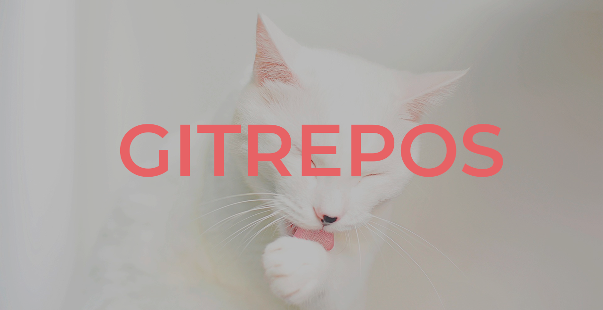

  

## What is GITREPOS

GITREPOS is an automated tool designed to simplify the creation, cloning, configuration, and management of repositories on GitLab and GitHub. This script allows you to manage repositories both in user accounts and organizations, automatically setting up remotes and facilitating the push process to both version control services.

## Contents of GITREPOS repository

The GITREPOS repository contains the following key files and modules:

- **main.py**: The main script that orchestrates the operations for creating, cloning, and removing repositories.
- **check_general_config_file.py**: A module responsible for verifying and creating, if necessary, general configuration files.
- **check_requirements.py**: A module that checks and installs the necessary dependencies to run GITREPOS.
- **clone_initial_repos.py**: Script that handles the cloning of initial repositories from GitLab.
- **clone_repo.py**: A module that allows finding and cloning a specific repository from GitLab.
- **create_repos.py**: Module for creating repositories on GitLab and GitHub.
- **remove_repos.py**: Module that handles the removal of repositories from GitLab, GitHub, and the local system.
- **local_config_file.py**: A module that manages the creation and updating of local configuration files for repositories.
- **utils.py**: Utility module that provides auxiliary functions for repository management, such as setting up remotes and managing commits.

## Prerequisites

Before running GITREPOS, ensure that the following prerequisites are met:

- **Python 3.6 or higher**: GITREPOS requires an up-to-date version of Python.
- **pip**: The Python package manager must be installed.
- **Git**: Version control tool installed on your system.
- **SSH Key**: Make sure you have an SSH key configured and accessible from your local environment.

## How to run

:warning: **You must have Python 3.6 or newer and GIT 2.39 or newer installed on your local system** :warning:

### 1. First of all, you must create a container directory where all repositories will be stored (optional)

> The script will create it

Example: my container configuration

- gitlab (container)
  - gitrepos (repo1)
  - personalRepo (repo2)
  - otherRepos (repo3)

### 2. Download or clone this repository

- Download the script: `wget https://gitlab.com/Nuria_Liano/gitrepos/-/raw/main/gitrepos.py?inline=false`
- Clone the repository
  - SSH:  `git clone git@gitlab.com:Nuria_Liano/gitrepos.git`
  - HTTPS:  `git clone https://gitlab.com/Nuria_Liano/gitrepos.git`

### 3. Install all requirements (optional)

> The script will install it

- Python: `pip install -r requirements.txt`

### 4. :exclamation: Important steps :exclamation: Edit the container.config.json file and change the file name to '.config.json'

This file contains all necessary global variables to execute the script. You must change all values for your own data.

~~~json
{
    "EMAIL": "nuria@email.com",
    "GH_USERNAME": "nuria",
    "GL_USERNAME": "nuria",
    "GH_TOKEN": "ghsdfsdgssdhPewghrBOnhgfdhdfX",
    "GL_TOKEN": "ghsdfsdgssdhPewghrBOnhgfdhdfX",
    "GH_URL": "https://api.github.com/nuria/repos",
    "GH_URL_GENERAL": "https://github.com/",
    "GL_URL": "https://gitlab.com",
    "GH_URL_REMOVE": "https://api.github.com/repos/"
}
~~~

> :pencil: When you finish editing, it is important to rename the file to '.config.json' and move it to your container git directory.

### 5. Execute script

~~~sh
python main.py
~~~

### 6. First, the script will check if all requirements and configurations are in place.

### 7. The script will prompt you to create, remove, or clone repositories

### 8. Now you can use that repository and you can execute git add and git commit -m "" normally

### 9. :warning: But when you execute git push it is necessary to run the gitPushMirror.sh

~~~sh
sh gitPushMirror.sh
~~~

## How to generate a mirror

To generate a mirror of a repository, GITREPOS automatically sets up the remotes for GitLab and GitHub. The git push process to both remotes is handled by the following command in the script `gitPushMirror.sh`

~~~py
gitlabRepo.git.remote('set-url', '--push', 'github', gh_repo_url)
gitlabRepo.git.remote('set-url', '--push', '--add', 'github', gl_repo_url)
~~~

This command pushes all changes from the local repository to both remotes, ensuring that the content is synchronized between GitLab and GitHub.

## Errors and suggestions

If you find a problem with the code or have implemented an improvement, please open an issue.

> :warning: Windows Users
> When running the gitPushMirror.sh script, you might need to set the script as executable using Git Bash

## TODO

- [x] generate .gitignore to ignore .config.json
- [x] add remote 
- [x] check dependencies
- [ ] gitPushBot: script that checks for changes in the repo every X minutes and executes gitPushMirror.sh automatically.

## License

All content in this repository is licensed under a [Creative Commons Attribution-NonCommercial 4.0 International Public License](https://gitlab.com/skilly-academy/gitrepos/-/blob/master/LICENSE)

## Contact

You can write to me at hola@nurialiano.es
---

Desarrollado en [cantabria](https://www.cantabria.es)💢 con mucho 🤘 y 🍺